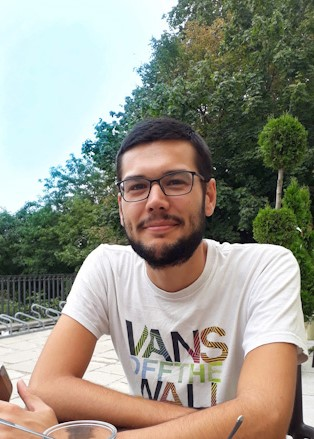

I'm Basilio Moreno Peralta, data analyst and social researcher based in Barcelona (Spain).

I studied political science and focused on quantitative methods and computational research.
This allowed me to work in different projects between academia and private businesses over the years on topics such as public opinion, market research and communication (social media).

Currently I work as a Data Analyst at the Data Science team in [Netquest](https://www.netquest.com/en). 

You can follow me on **[LinkedIn](https://www.linkedin.com/in/basiliomp/)**, **[Twitter](www.twitter.com/basiliomp)** and **[GitHub](https://github.com/basiliomp/)**, or maybe get in contact by mail at _basiliomperalta [a] gmail.com_ .

